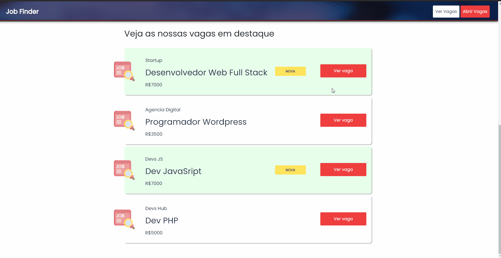

<p align="center">  </p>

---

## 📖 Sobre o Projeto

O Job Finder é uma plataforma onde programadores podem pesquisar por vagas de emprego. As empresas também podem divulgar suas vagas para encontrar um perfil de dev adequado. Foi idealizado durante o curso de [JavaScript do básico ao avançado](https://www.udemy.com/share/102Ha4BUQfdVtbR34=/).


<p align="center"></p>

- ## Página de vagas com busca

<p align="center"></p>

- ## Página abertura de vagas

<p align="center"></p>

- ## Página informações da vaga

<p align="center"></p>

<br><br>

## 🔨Tecnologias e Ferramentas Utilizadas

**Front-end**
- HTML
- CSS
- Bootstrap
- Hendlebars

**Back-end**
- Node.js
- Nodemon
- Express
- SQLite
- Sequelize

<br><br>

## 🚀 Executando o projeto

 **Realize a instalação das seguintes ferramentas**

>[VSCode](https://code.visualstudio.com/)

>[Git](https://git-scm.com)

>[Node.js](https://nodejs.org/en/)

```bash
# Download do repositório
git clone https://github.com/magaliais/proffy

# No VSCode dentro da pasta do projeto na barra de navegação
# clique em terminal, em seguida "New Terminal"
# Baixar as dependências
npm install

# Execute o servidor
npm run dev

# Abra o browser em
http://localhost:3000
```